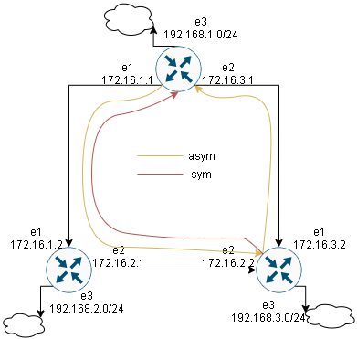

# OSPF

## Задание
- Поднять три виртуалки  
- Объединить их разными private network  
1. Поднять OSPF между машинами средствами программных маршрутизаторов на выбор: Quagga, FRR или BIRD  
2. Изобразить ассиметричный роутинг  
3. Сделать один из линков "дорогим", но что бы при этом роутинг был симметричным  

## Решение
[Стенд](Vagrantfile) из 3 машин настраивается с машины provision плейбуком [ospf.yml](ospf.yml)  
для успешного провижена нужен ip_forward=1 и доступ к TCP портам 10022, 11022, 12022 на адресе хоста 192.168.220.1  
## Установка FRR
Отключаю фильтрацию маршрутов
```bash
net.ipv4.conf.eth1.rp_filter=2
```
FRR устанавливается из пакета с [github](https://github.com/FRRouting/frr/releases/download/frr-7.2/frr-7.2-01.el7.centos.x86_64.rpm)  
в нем включается демон ospfd  
```bash
/etc/frr/daemons
...
ospfd=yes
...
```
конфиг на роутерах через темлпейт ospfd.conf.j2  
```bash
hostname {{ item.hostname }}
log file /var/log/frr/ospfd.log
interface {{ item.dev1 }}
ip ospf cost {{ item.cost1 }}
ip ospf hello-interval 5
ip ospf dead-interval 10
interface {{ item.dev2 }}
ip ospf cost {{ item.cost2  }}
ip ospf hello-interval 5
ip ospf dead-interval 10
router ospf
ospf router-id {{ item.id }}
redistribute connected
passive interface eth0
network {{ item.lan }}  area 0.0.0.0
network {{ item.wan1 }} area 0.0.0.0
network {{ item.wan2 }} area 0.0.0.0
```
## Ассиметричный роутинг
на Router1 цена линка eth2 с Router3 = 100  
```bash
[vagrant@Router1 ~]$ ip ro
default via 10.0.2.2 dev eth0 proto dhcp metric 100 
10.0.2.0/24 dev eth0 proto kernel scope link src 10.0.2.15 metric 100 
172.16.1.0/30 dev eth1 proto kernel scope link src 172.16.1.1 
172.16.2.0/30 via 172.16.1.2 dev eth1 proto 188 metric 20 
172.16.3.0/30 dev eth2 proto kernel scope link src 172.16.3.1 
192.168.1.0/24 dev eth3 proto kernel scope link src 192.168.1.1 
192.168.2.0/24 via 172.16.1.2 dev eth1 proto 188 metric 20 
192.168.3.0/24 via 172.16.1.2 dev eth1 proto 188 metric 20 
```
```bash
[vagrant@Router1 ~]$ traceroute 192.168.3.1
traceroute to 192.168.3.1 (192.168.3.1), 30 hops max, 60 byte packets
 1  172.16.1.2 (172.16.1.2)  0.308 ms  0.159 ms  0.222 ms
 2  192.168.3.1 (192.168.3.1)  0.443 ms  0.288 ms  0.389 ms
```
на Router3 цена линка eth1 с Router1 = 10  
```bash
[vagrant@Router3 ~]$ ip ro
default via 10.0.2.2 dev eth0 proto dhcp metric 100 
10.0.2.0/24 dev eth0 proto kernel scope link src 10.0.2.15 metric 100 
172.16.1.0/30 proto 188 metric 20 
	nexthop via 172.16.2.1 dev eth2 weight 1 
	nexthop via 172.16.3.1 dev eth1 weight 1 
172.16.2.0/30 dev eth2 proto kernel scope link src 172.16.2.2 
172.16.3.0/30 dev eth1 proto kernel scope link src 172.16.3.2 
192.168.1.0/24 via 172.16.3.1 dev eth1 proto 188 metric 20 
192.168.2.0/24 via 172.16.2.1 dev eth2 proto 188 metric 20 
192.168.3.0/24 dev eth3 proto kernel scope link src 192.168.3.1 
```
```bash
[vagrant@Router3 ~]$ traceroute 192.168.1.1
traceroute to 192.168.1.1 (192.168.1.1), 30 hops max, 60 byte packets
 1  192.168.1.1 (192.168.1.1)  0.370 ms  0.166 ms  0.309 ms
```

## Симметричный роутинг
цену линка eth1 на Router3 делаю равной цене линка eth2 на Router1 - 100  
```bash
[vagrant@Router3 ~]$ ip ro
default via 10.0.2.2 dev eth0 proto dhcp metric 100 
10.0.2.0/24 dev eth0 proto kernel scope link src 10.0.2.15 metric 100 
172.16.1.0/30 via 172.16.2.1 dev eth2 proto 188 metric 20 
172.16.2.0/30 dev eth2 proto kernel scope link src 172.16.2.2 
172.16.3.0/30 dev eth1 proto kernel scope link src 172.16.3.2 
192.168.1.0/24 via 172.16.2.1 dev eth2 proto 188 metric 20 
192.168.2.0/24 via 172.16.2.1 dev eth2 proto 188 metric 20 
192.168.3.0/24 dev eth3 proto kernel scope link src 192.168.3.1 
```
```bash
[vagrant@Router3 ~]$ traceroute 192.168.1.1
traceroute to 192.168.1.1 (192.168.1.1), 30 hops max, 60 byte packets
 1  172.16.2.1 (172.16.2.1)  0.307 ms  0.157 ms  0.181 ms
 2  192.168.1.1 (192.168.1.1)  0.619 ms  0.499 ms  0.540 ms
```

Видно что теперь на роутере 3 маршрут к 1 идет через 2  

